# 📄 Documentación de Tarea: Configuración de Active Directory

> **Preparado por:** Asier  
> **Fecha:** 07 de enero de 2026  
> **Entorno:** Windows Server + pfSense + Clientes Windows

---

## Introducción

Este documento detalla los pasos realizados para configurar un entorno básico de Active Directory, incluyendo la preparación del servidor, la configuración de red y puerta de enlace, la conexión a Internet y la unión de clientes al dominio.

---

## 1. Configuración de la Puerta de Enlace (pfSense)

Primero, se configuró el firewall y router `pfSense` como puerta de enlace para la red interna.

### Pasos realizados:
- Se creó y configuró el pfSense.

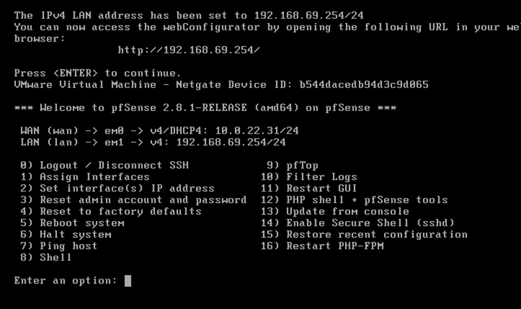

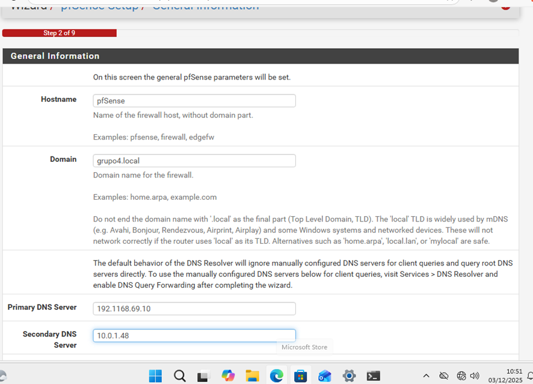

- Se definió el pool DHCP para asignar direcciones IP a los clientes.

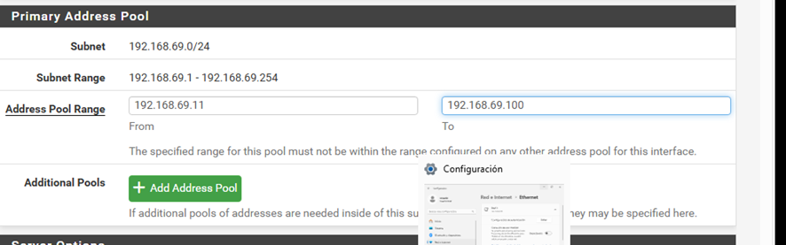

- Se verificó que las reglas de red permitan la comunicación entre clientes y servidor.

---

## 2. Configuración de Internet del Servidor

Una vez configurada la red, se procedió a instalar y configurar el servidor Windows.

### Pasos realizados:
- Se instaló Windows Server.

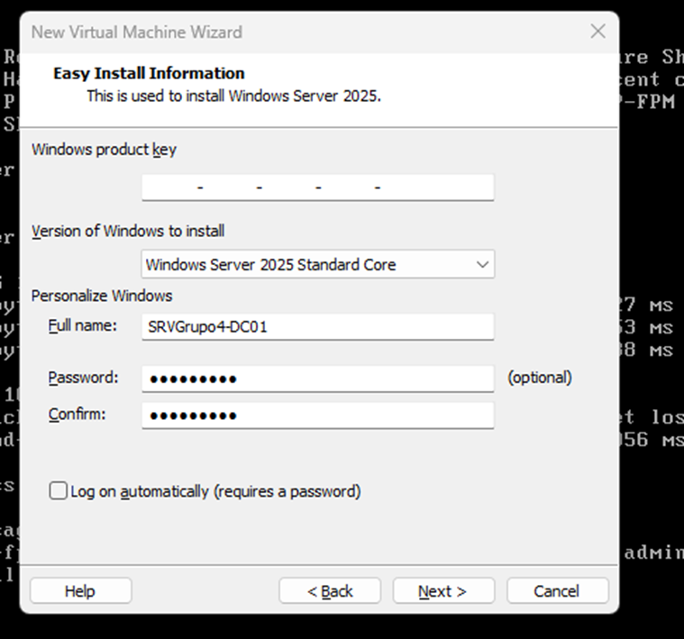

- Se configuró el nombre del servidor.

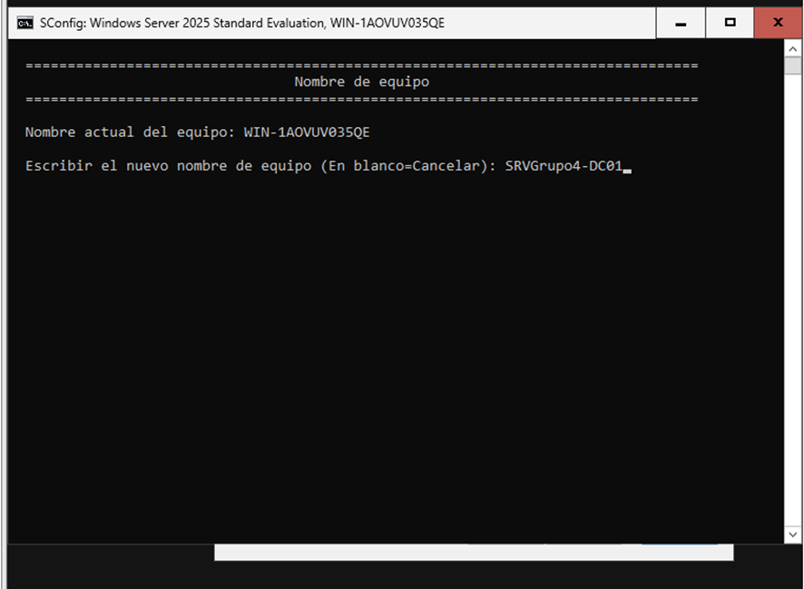

- Se configuraron las propiedades de red (IP estática, máscara, puerta de enlace y DNS).

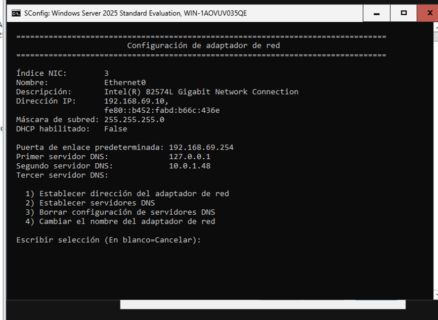

- Se reinició el servidor para aplicar los cambios.

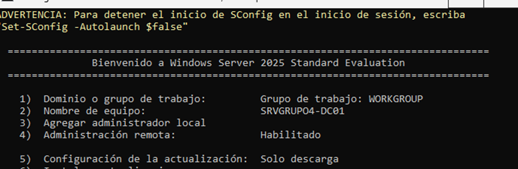

---

## 3. Creación de Clientes para el Dominio

Para integrar equipos al dominio, se realizaron los siguientes pasos:

### 3.1. Preparación del cliente
- Se creó una máquina virtual cliente.
- Se configuró su adaptador de red para estar en la misma red que el servidor.

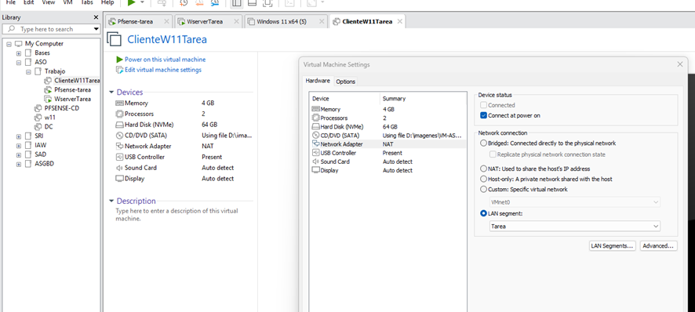

- Se asignó manualmente la dirección IP.
- **Importante:** El cliente debe apuntar al DNS del servidor de dominio.

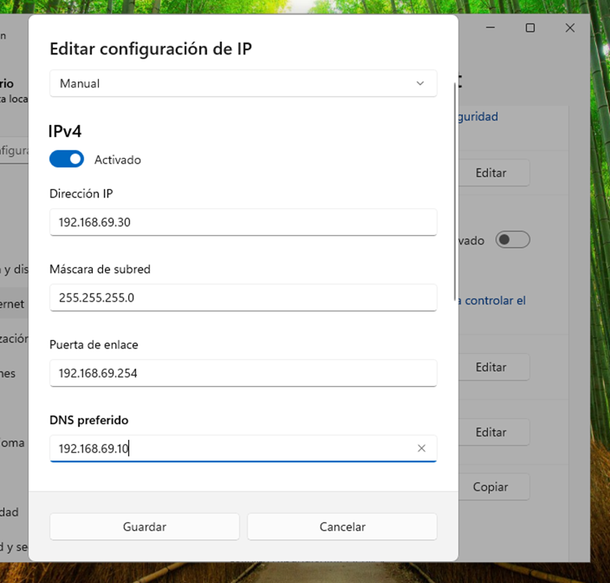

### 3.2. Verificación de conectividad
- Se comprobó la conectividad con el servidor mediante `ping`.

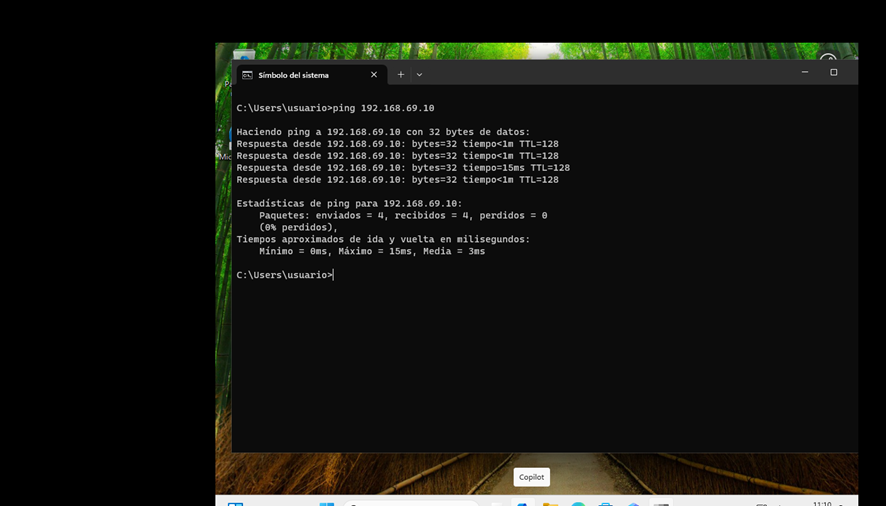

### 3.3. Unión al dominio
- Se cambió el nombre del equipo cliente.

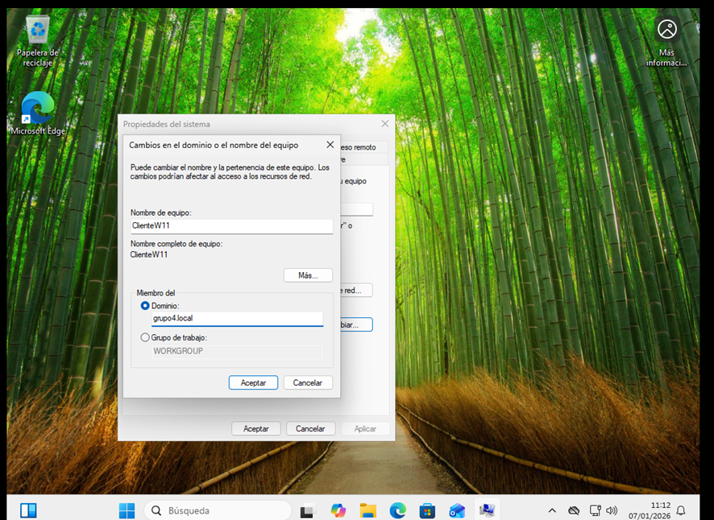

- Se unió el equipo al dominio usando credenciales de administrador.

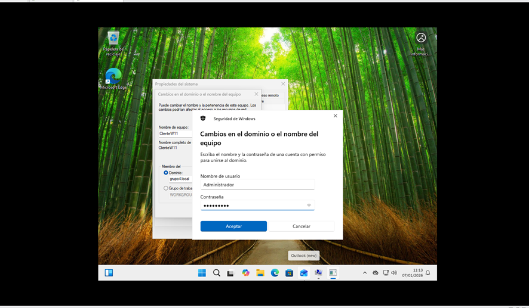

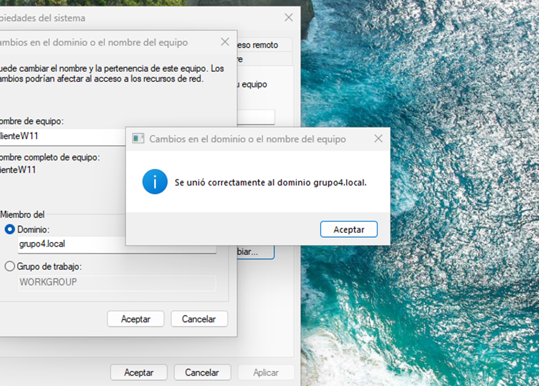

- Se reinició el equipo cliente para aplicar los cambios.

---

## 4. Validación desde el Controlador de Dominio

Finalmente, se verificó desde el controlador de dominio que los equipos se hubieran unido correctamente.

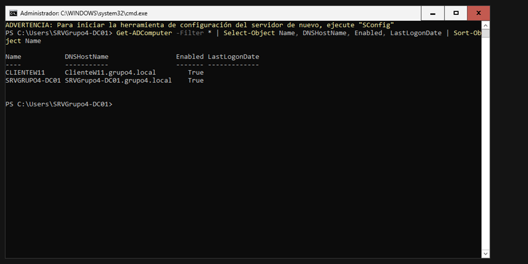

