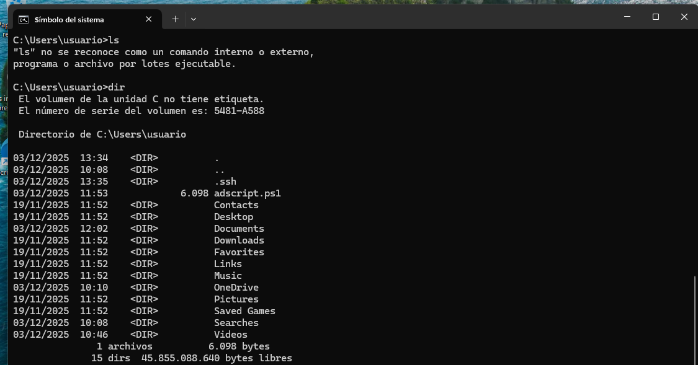
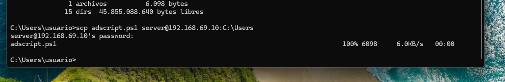
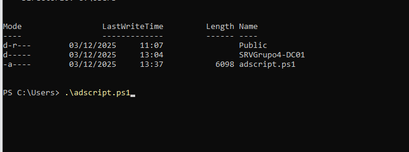
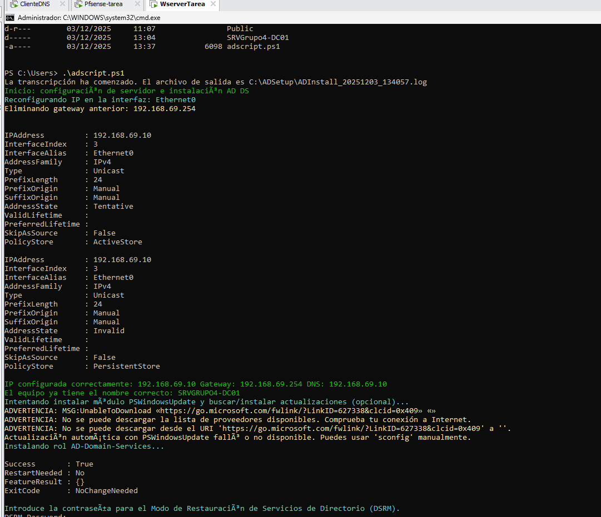
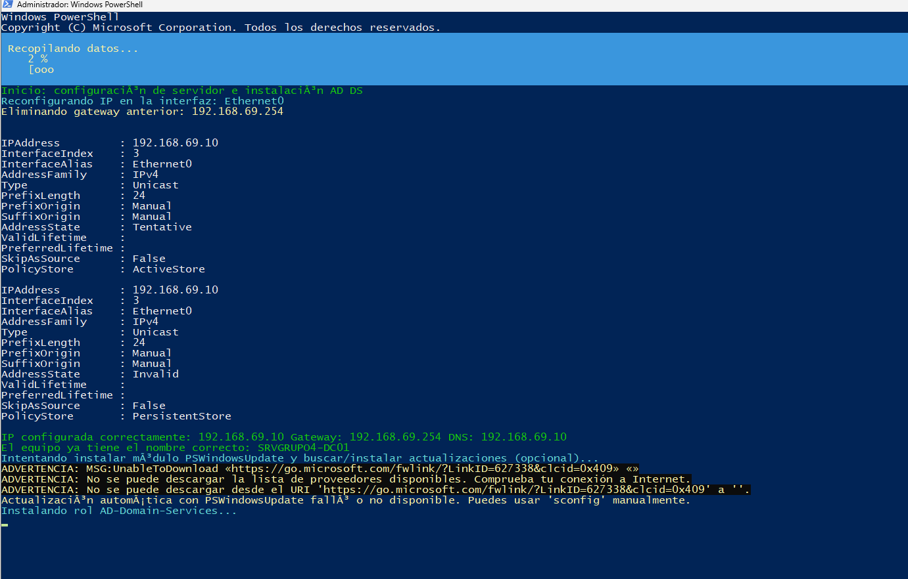
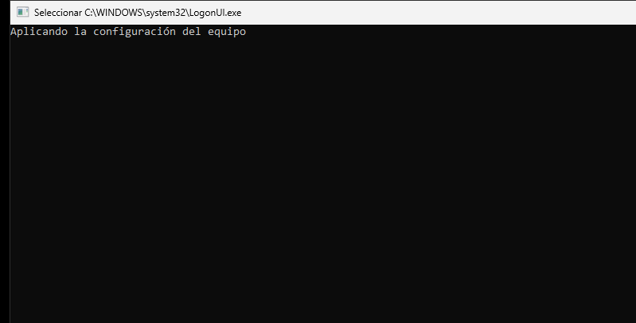
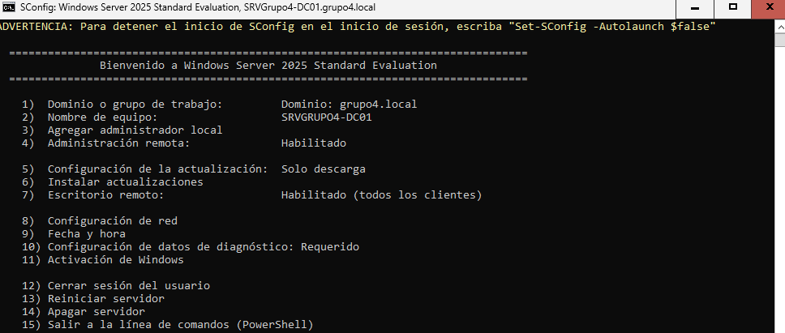

# 📄 Documentación: Script de Instalación Automática de Controlador de Dominio (AD DS)

**Autor:** Elias Halloumi El Amraoui  
**Fecha:** 9 de enero de 2026  
**Entorno:** Windows Server 2025 Standard Evaluation (Core)  
**Objetivo:** Automatizar la configuración de un servidor como Controlador de Dominio (DC) con Active Directory Domain Services (AD DS).

---

## 🧩 ¿Qué hace este script?

Este script PowerShell automatiza la instalación y configuración de un Controlador de Dominio (DC) en un sistema Windows Server Core, creando un nuevo bosque (*forest*) con el dominio **grupo4.local**.

### Funcionalidades principales

- ✅ Configura la red (IP estática, puerta de enlace y DNS).
- ✅ Renombra el equipo al nombre deseado (**SRVGrupo4-DC01**).
- ⚠️ Intenta instalar actualizaciones (opcional, puede fallar sin Internet).
- ✅ Instala el rol **AD-Domain-Services**.
- ✅ Promueve el servidor a DC usando `Install-ADDSForest`.
- 🔄 Reinicia automáticamente cuando es necesario.
- 📜 Genera un archivo de log con toda la actividad.

---

## ⚙️ ¿Cómo funciona el script? (Flujo detallado)

### 🔹 Paso 1: Configuración de red (si no usa DHCP)

```powershell
# Configuración de IP estática, gateway y DNS
```

👉 Esto asegura que el servidor tenga una dirección IP fija antes de promoverlo a DC.

---

### 🔹 Paso 2: Renombrar equipo

```powershell
# Rename-Computer -NewName SRVGrupo4-DC01 -Restart
```

⚠️ **Importante:** El script se reinicia aquí. Para continuar automáticamente, se debería usar una tarea programada (no incluida en el script original).

---

### 🔹 Paso 3: Actualización opcional

```powershell
# Install-WindowsUpdate
```

⛔ En entornos sin Internet o con restricciones, esto fallará silenciosamente.

---

### 🔹 Paso 4: Instalar rol AD DS

```powershell
Install-WindowsFeature AD-Domain-Services -IncludeManagementTools
```

✅ Se instala el rol y se importa el módulo necesario para la promoción.

---

### 🔹 Paso 5: Pedir contraseña DSRM

```powershell
$DSRMPassword = Read-Host -AsSecureString "DSRM Password"
```

⚠️ Requiere entrada manual → no es adecuado para automatización total.

---

### 🔹 Paso 6: Promover a Controlador de Dominio

```powershell
Install-ADDSForest \
    -DomainName "grupo4.local" \
    -SafeModeAdministratorPassword $DSRMPassword \
    -InstallDNS \
    -Force
```

🔁 Inicia la promoción del DC y reinicia automáticamente al finalizar.

---

### 🔹 Paso 7: Finalización y registro

```powershell
Stop-Transcript
```

📌 Todo el proceso queda registrado en un archivo `.log` en `C:\ADSetup\`.

---

## Ejeccución del script en nuestro servidor

### 📸 Captura 1: Interfaz del core



**Descripción:** Acceder al servidor core desde un cliente para pasar el script de.

**Indica que:**
- El servidor ya fue configurado como DC.
- La administración remota y RDP están habilitados.
- Se puede acceder a PowerShell para ejecutar scripts.

---

### 📸 Captura 2: Ejecución del script


- Script: `adscript.ps1`
- Ubicación: `C:\Users\`
- Ejecución correcta sin errores visibles.

---

### 📸 Captura 3 y 4: Aplicación de configuración


- El sistema aplica cambios de red y nombre.
- Parte del reinicio automático tras `Rename-Computer`.

---

### 📸 Captura 5 y 6: Logs de ejecución



**Información relevante:**
El sistema se ha reiniciado y ya esta todo configurado
- IP configurada: `192.168.69.10`
- Gateway: `192.168.69.254`
- DNS: `192.168.69.10`
- Nombre correcto del equipo.
- Fallo en actualizaciones (sin Internet).
- Rol AD DS instalado correctamente.
- Script detenido esperando contraseña DSRM.

---

## ⚠️ Problemas detectados y recomendaciones

| Problema | Descripción | Recomendación |
|--------|-------------|---------------|
| ❗ Interacción manual | `Read-Host` requiere entrada | Usar contraseña cifrada |
| ❗ Actualizaciones | PSWindowsUpdate falla sin Internet | Omitir en automatización |
| ❗ Reinicios | Script no continúa tras reinicio | Usar tarea programada |
| ❗ Rutas | Usa rutas por defecto | Verificar discos y permisos |

---

## 📌 Conclusión

Este script es ideal para **entornos de laboratorio** y pruebas en Windows Server Core.  
Con pequeñas mejoras, puede evolucionar hacia una solución robusta para producción.

---

## 📎 Recursos útiles

- Microsoft Docs: *Install-ADDSForest*
- PSWindowsUpdate (GitHub)
- Configuración de Windows Server Core con PowerShell

