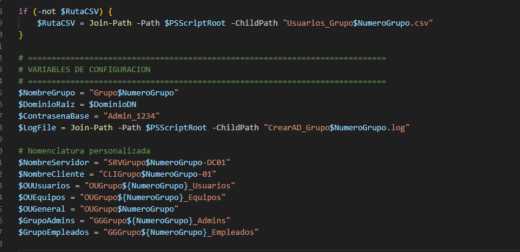
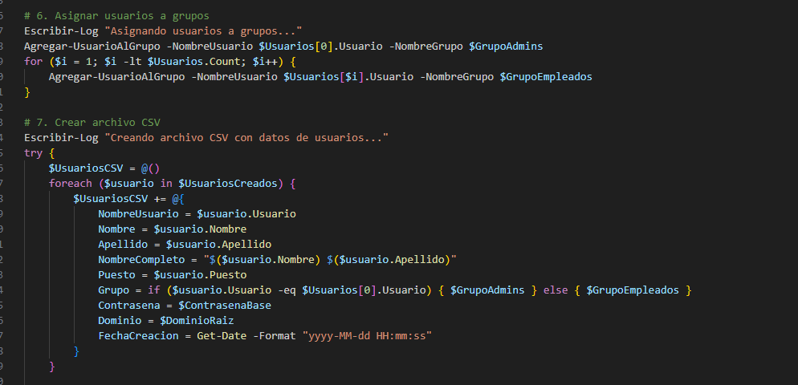
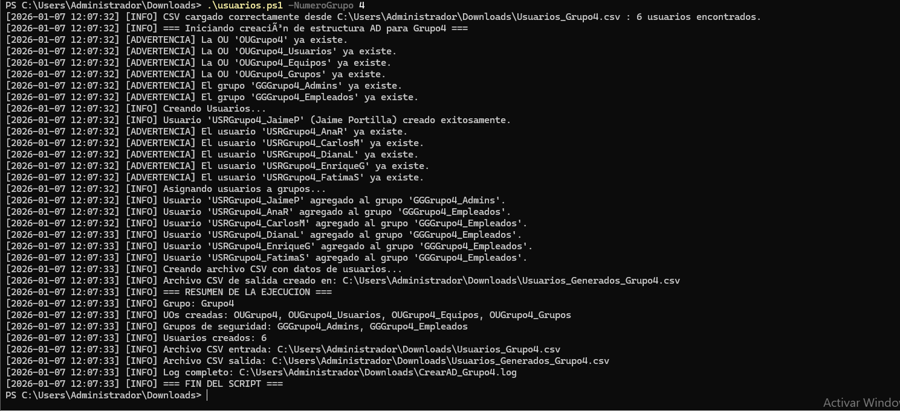
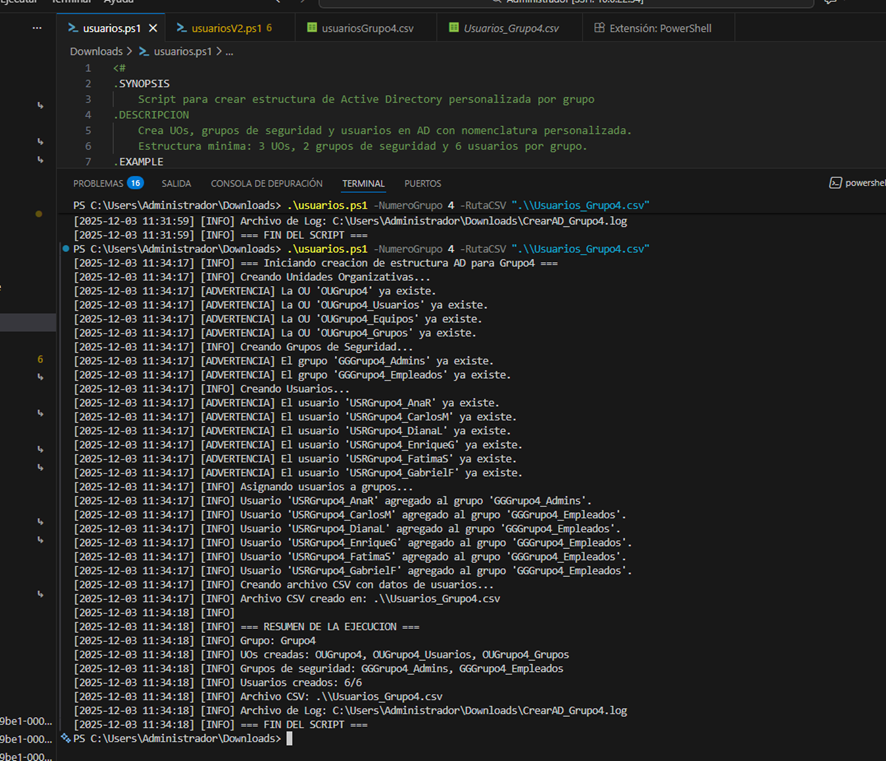
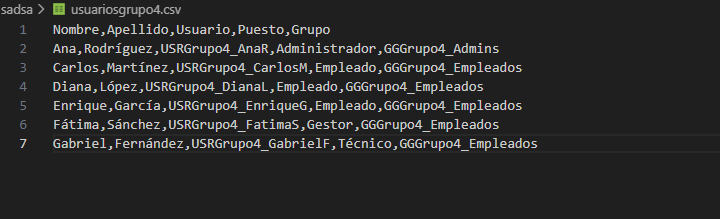
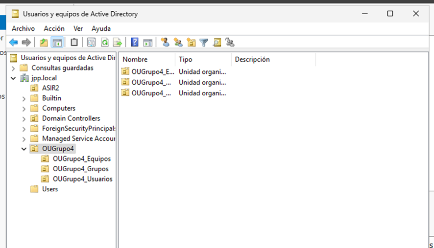
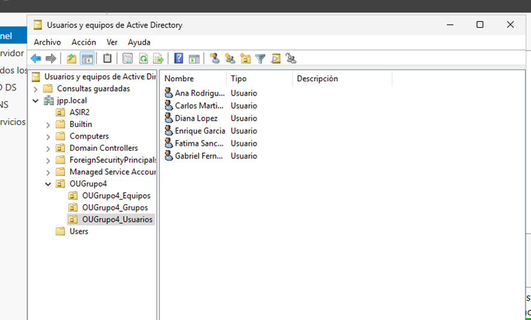
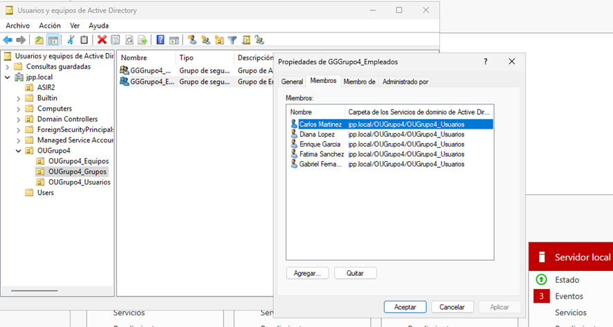
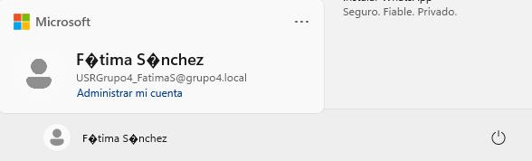

# 📄 Documentación de Tarea: Script de automatización con CSV
**✨ Resumen:** Script para automatizar la creación de UOs, grupos y usuarios en Active Directory a partir de CSV.

## 👤 Autor: Jaime Portilla Pérez
## 🔖 Versión: 1.0
## 📅 Fecha: 10/01/2026

# 1. Objetivo 🎯
Crear un script que realice las siguientes tareas:
- 📁 Recibir rutas de CSV como parámetros.
- 📥 Importar datos desde CSV.
- 🏷️ Crear UOs (Unidades Organizativas), grupos y usuarios solo si no existen.
- 👥 Asignar usuarios a grupos según el CSV.
- ⚙️ Utilizar funciones para mejorar la modularidad.
- 📝 Incluir una cabecera profesional (autor, versión, fecha).
- 🔒 Evitar datos hardcodeados; lectura únicamente desde CSV.
- ✅ Realizar comprobaciones básicas de validez.
- 🗂️ Generar un archivo de logs con información relevante del proceso.

# 2. Desarrollo del Script 🔧
El script está desarrollado en PowerShell y cumple los requisitos indicados en el objetivo. A continuación se describen sus principales características y funcionalidades:

- **📁 Parámetros de entrada**: Acepta rutas de archivos CSV como parámetros, facilitando su personalización y reutilización.
- **📥 Importación de datos**: Utiliza `Import-Csv` para leer los datos desde los archivos CSV.
- **🏗️ Creación de objetos**: Implementa funciones para crear Unidades Organizativas (UOs), grupos y usuarios en Active Directory, comprobando previamente si ya existen para evitar duplicados.
- **⚙️ Funciones modulares**: Estructurado en funciones para mejorar la legibilidad y facilitar el mantenimiento.
- **✅ Comprobaciones básicas**: Valida los datos antes de realizar las operaciones.
- **📝 Generación de logs**: Crea un archivo de registro (log) que documenta las acciones realizadas y los errores encontrados.
- **👥 Asignación de usuarios a grupos**: Asigna usuarios a los grupos correspondientes según los datos del CSV.






--- 

# 3. Ejecución del Script ▶️
⚠️ **Requisitos:** PowerShell con privilegios de administrador y el módulo `ActiveDirectory` (RSAT) instalado.

Para ejecutar el script, abre PowerShell como Administrador y usa el siguiente comando (reemplaza las rutas de los archivos CSV según corresponda):

```powershell
.\ScriptAutomatizacion.ps1 "C:\ruta\UOs.csv"
```



Una vez finalizada la ejecución, revisa el archivo de logs generado para verificar que todas las operaciones se realizaron correctamente.

ℹ️ **Nota:** El script crea un archivo de logs en el mismo directorio del script; comprueba permisos y rutas si no aparece el fichero.



Las siguientes imágenes muestran ejemplos de la estructura de los archivos CSV utilizados y los resultados obtenidos al ejecutar el script:

📄 **Ejemplo de CSV**



Este CSV contiene columnas como: **OU**, **Grupo**, **SamAccountName**, **Nombre**, **Apellidos**, **Departamento** y **Email**. El script mapea cada fila para crear o actualizar UOs, grupos y usuarios de forma idempotente (no crea duplicados si ya existen).

🔍 **Verificación en Active Directory**

Se puede comprobar en Active Directory que las UOs, grupos y usuarios se crearon según lo especificado en los CSV. A continuación se muestran capturas representativas:

- **UOs creadas**



  Muestra la jerarquía resultante y la ubicación donde se han creado las Unidades Organizativas.

- **Grupos creados**


  Muestra los grupos con su nombre y ámbito de seguridad; revisa propiedades como `Miembros` y `Descripcion` para confirmar.

- **Usuarios creados y asignados**



  Indica usuarios con sus atributos básicos y la pertenencia a los grupos.

✅ **Resultado final**

Cada usuario fue asignado al grupo indicado en el CSV y se refleja en la vista final de AD:



**Consejos de comprobación rápida:**

- Usa `Get-ADOrganizationalUnit -Filter *` para listar UOs.
- Usa `Get-ADGroup -Filter *` y `Get-ADGroupMember <NombreGrupo>` para verificar miembros.
- Usa `Get-ADUser -Filter * -Properties MemberOf` para comprobar pertenencias.
- Revisa el archivo de logs para confirmar las operaciones realizadas y detectar posibles errores.


--- 

# 4 Errores comunes y soluciones 🛠️
El unico error que he detectado al ejecutar el script es el siguiente:

Los usuarios con caracteres especiales en el nombre (como ñ, á, é, í, ó, ú) no se crean correctamente y generan un error de codificación.

Pero esto se puede solucionar guardando los archivos CSV con codificación UTF-8 sin BOM.



# 5. Conclusión ✅
El script desarrollado cumple todos los requisitos establecidos en el objetivo inicial.

La automatización de la creación de UOs, grupos y usuarios a partir de archivos CSV facilita la gestión administrativa y reduce errores humanos. Su estructura modular y la generación de logs permiten un mantenimiento sencillo y una auditoría clara de las acciones realizadas. En resumen, es una herramienta eficaz para la administración de Active Directory en entornos empresariales.

--- 

# 6. Referencias 🔗

- [Documentación oficial de PowerShell](https://learn.microsoft.com/powershell/)
- [RSAT / Active Directory (Windows)](https://learn.microsoft.com/windows-server/remote/remote-server-administration-tools)
- IA Grok para asistencia en la generación de scripts y resolución de problemas.
